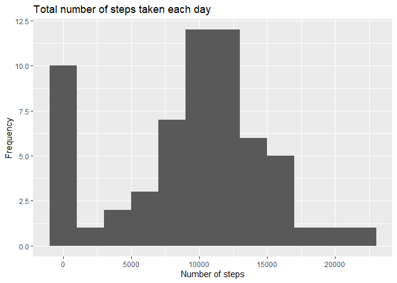
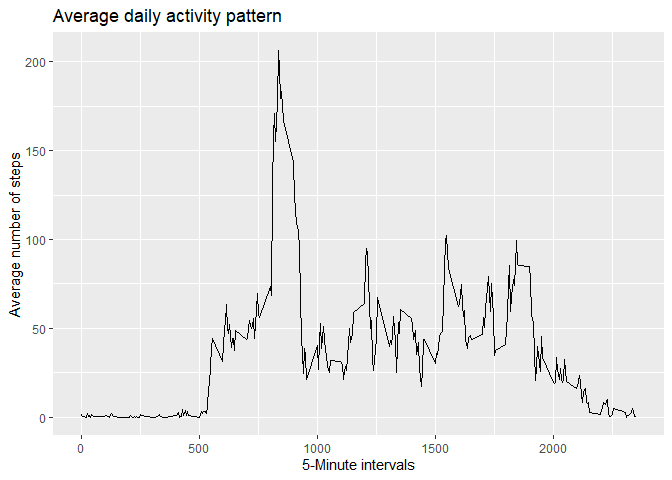
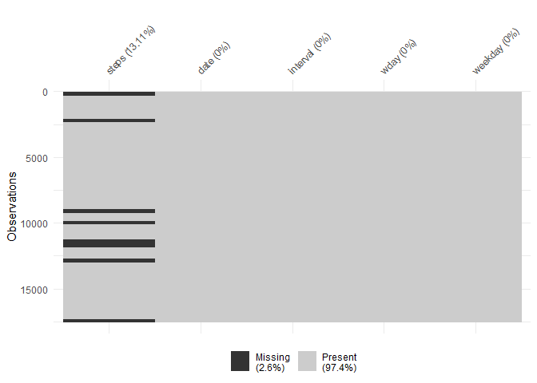
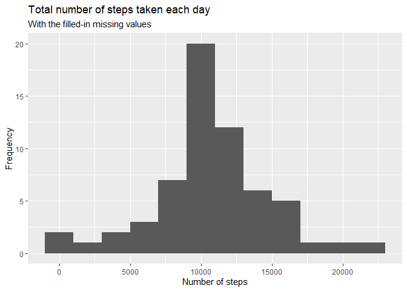
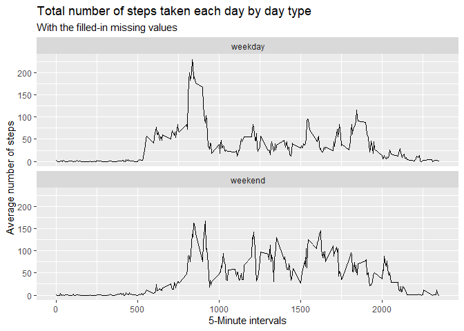

## **About**

This is the first project under the Reproducible Research course in Coursera’s "Data Science Foundations using R" program. 

This assignment makes use of data from a personal activity monitoring device. This device collects data at 5 minute intervals through out the day. The data consists of two months of data from an anonymous individual collected during the months of October and November, 2012 and include the number of steps taken in 5 minute intervals each day.

## **Data**

The data for this assignment was downloaded from the course web site:

- Dataset: [Activity monitoring data 52K](https://d396qusza40orc.cloudfront.net/repdata/data/activity.zip) 

The variables included in this dataset are:

- steps: Number of steps taking in a 5-minute interval (missing values are coded as NA)

- date: The date on which the measurement was taken in YYYY-MM-DD format

- interval: Identifier for the 5-minute interval in which measurement was taken

The dataset is stored in a comma-separated-value (CSV) file and there are a total of 17,568 observations in this dataset.


## **Loading and preprocessing the data**


```r
# Loading of the required libraries

library(dplyr)
library(ggplot2)
library(lubridate)
library(visdat)
library(knitr)
```


```r
activity <- unzip("activity.zip")

base <- read.csv("activity.csv", stringsAsFactors = FALSE)

glimpse(base)
```

```
## Rows: 17,568
## Columns: 3
## $ steps    <int> NA, NA, NA, NA, NA, NA, NA, NA, NA, NA, NA, NA, NA, NA, NA, N…
## $ date     <chr> "2012-10-01", "2012-10-01", "2012-10-01", "2012-10-01", "2012…
## $ interval <int> 0, 5, 10, 15, 20, 25, 30, 35, 40, 45, 50, 55, 100, 105, 110, …
```


We format the date field and recode the date to generate: 

1. The date variable with date format, 
2. variable day of the week (specifying to start the week with Monday 'Monday = 1'), and 
3. a factor variable with two levels -weekday and weekend- indicating whether a given date is a weekday or weekend day.


```r
base <- base %>% mutate(date = as.Date(date), 
                        wday = as.factor(wday(date, week_start = 1))) %>% 
                        mutate(weekday = as.factor(if_else(wday %in% c("6", "7"), 
                                              "weekend", "weekday")))
glimpse(base)
```

```
## Rows: 17,568
## Columns: 5
## $ steps    <int> NA, NA, NA, NA, NA, NA, NA, NA, NA, NA, NA, NA, NA, NA, NA, N…
## $ date     <date> 2012-10-01, 2012-10-01, 2012-10-01, 2012-10-01, 2012-10-01, …
## $ interval <int> 0, 5, 10, 15, 20, 25, 30, 35, 40, 45, 50, 55, 100, 105, 110, …
## $ wday     <fct> 1, 1, 1, 1, 1, 1, 1, 1, 1, 1, 1, 1, 1, 1, 1, 1, 1, 1, 1, 1, 1…
## $ weekday  <fct> weekday, weekday, weekday, weekday, weekday, weekday, weekday…
```


```r
# Summary of the main variables

base %>% select(steps, wday, weekday) %>% summary()
```

```
##      steps        wday        weekday     
##  Min.   :  0.00   1:2592   weekday:12960  
##  1st Qu.:  0.00   2:2592   weekend: 4608  
##  Median :  0.00   3:2592                  
##  Mean   : 37.38   4:2592                  
##  3rd Qu.: 12.00   5:2592                  
##  Max.   :806.00   6:2304                  
##  NA's   :2304     7:2304
```


## **What is mean total number of steps taken per day?**

### Histogram of the total number of steps taken each day


```r
base %>% group_by(date) %>% summarize(total_steps = sum(steps, na.rm = TRUE)) %>% 
          ggplot(aes(total_steps)) + geom_histogram(binwidth = 2000) + 
          ggtitle("Total number of steps taken each day") +
          xlab("Number of steps") + ylab("Frequency")
```

<!-- -->


### The mean and median total number of steps taken per day


```r
# First, we group the data by date

diary <- base %>% group_by(date) %>% summarize(tot_steps = sum(steps)) 
                    
diary %>% summarize(mean = sprintf("%0.1f", mean(tot_steps, na.rm = TRUE)), 
                    median = sprintf("%0.1f", median(tot_steps, na.rm = TRUE))) 
```

```
## # A tibble: 1 × 2
##   mean    median 
##   <chr>   <chr>  
## 1 10766.2 10765.0
```


## **What is the average daily activity pattern?**


```r
#First, we group the data by intervals and obtain the mean for each one.

interval <- base %>% group_by(interval) %>% summarize(avg_steps = mean(steps, na.rm = TRUE))
```


### Time series plot of the 5-minute interval and the average number of steps taken, averaged across all days


```r
ggplot(interval, aes(interval, avg_steps)) + geom_line() + 
        ggtitle("Average daily activity pattern") +
        xlab("5-Minute intervals") + ylab("Average number of steps")
```

<!-- -->


### Which 5-minute interval, on average across all the days in the dataset, contains the maximum number of steps?


```r
interval %>% filter(avg_steps == max(avg_steps))
```

```
## # A tibble: 1 × 2
##   interval avg_steps
##      <int>     <dbl>
## 1      835      206.
```

The maximum value is in the interval 835, with 206 average steps.


## **Imputing missing values**


### The total number of missing values in the dataset and the plot


```r
# Number of missing values

sum(is.na(base))
```

```
## [1] 2304
```

```r
# Plot of missing values

vis_miss(base)
```

<!-- -->


From the plot we can see that the missing values are only in the variable "steps" and that they represent 13.1 %.


### Strategy

For missing values, we designed a strategy to impute them using the average for that 5-minute interval


```r
# We merge the original base with the interval base.

base1 <- base %>% left_join(interval, by = "interval")
```


### Create a new dataset that is equal to the original dataset but with the missing data filled in.


```r
base2 <- base1 %>% mutate(steps_filled = ifelse(is.na(steps), avg_steps, steps)) %>% 
         select(steps_filled, date, interval, wday, weekday, -steps, -avg_steps)

glimpse(base2)
```

```
## Rows: 17,568
## Columns: 5
## $ steps_filled <dbl> 1.7169811, 0.3396226, 0.1320755, 0.1509434, 0.0754717, 2.…
## $ date         <date> 2012-10-01, 2012-10-01, 2012-10-01, 2012-10-01, 2012-10-…
## $ interval     <int> 0, 5, 10, 15, 20, 25, 30, 35, 40, 45, 50, 55, 100, 105, 1…
## $ wday         <fct> 1, 1, 1, 1, 1, 1, 1, 1, 1, 1, 1, 1, 1, 1, 1, 1, 1, 1, 1, …
## $ weekday      <fct> weekday, weekday, weekday, weekday, weekday, weekday, wee…
```


### New histogram of the total number of steps taken each day


```r
base2 %>% group_by(date) %>% summarize(tot_steps = sum(steps_filled)) %>% 
          ggplot(aes(tot_steps)) + geom_histogram(binwidth = 2000) +
          ggtitle("Total number of steps taken each day", 
                  subtitle = "With the filled-in missing values") +
          xlab("Number of steps") + ylab("Frequency")
```

<!-- -->


### The mean and median total number of steps taken per day


```r
base2 %>% group_by(date) %>% summarize(total = sum(steps_filled)) %>% 
          summarize(mean = sprintf("%0.1f", mean(total)), 
                    median = sprintf("%0.1f", median(total)))
```

```
## # A tibble: 1 × 2
##   mean    median 
##   <chr>   <chr>  
## 1 10766.2 10766.2
```


The mean and median values do not differ greatly from the estimates of the first part of the assignment.

The impact of the imputation of missing data on the estimates of the total number of daily steps is practically nil.


## **Are there differences in activity patterns between weekdays and weekends?**


### Panel plot containing a time series plot of the 5-minute interval and the average number of steps taken, averaged across all weekday days or weekend days


```r
base2 %>% group_by(interval, weekday) %>% summarize(avg_steps = mean(steps_filled)) %>% 
        ggplot(aes(interval, avg_steps)) + geom_line() + facet_wrap(~ weekday, nrow = 2) +
        ggtitle("Total number of steps taken each day by day type", 
                subtitle = "With the filled-in missing values") +
        xlab("5-Minute intervals") + ylab("Average number of steps")
```

<!-- -->


In general, the daily activity patterns are maintained, however, the maximum value on weekends decreases with respect to weekdays, although they remain in the range of 750-1000. 

On the other hand, activity increases on weekends in the range of 1000-1750 with respect to weekdays.


